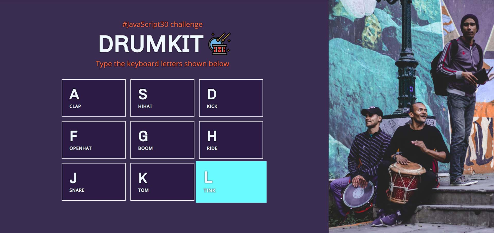

# JavaScript exercise 2 - Drum Kit
> My second practical project while learning JavaScript. [Click here to preview](https://karbudzik.github.io/JavaScript-exercise-2-drumkit/) 
> Script based on the JavaScript30 challenge, with new visual layout.

## Screenshots

## Technologies
* HTML5.2
* plain CSS / no frameworks
* plain JavaScript / no frameworks

## Credits
* [JavaScript30 challenge](https://javascript30.com) - the script was based on the materials provided for the JavaScript30 challenge
* [Wes Bos](https://wesbos.com/about/) - main website of the initiative's author - Wes Bos
* [dribble.com](https://dribbble.com/shots/3712124--JavaScript30-Day-1-JS-Drum-Kit) - inspiration for the visual part of the project, thanks to Celena Jasmin
